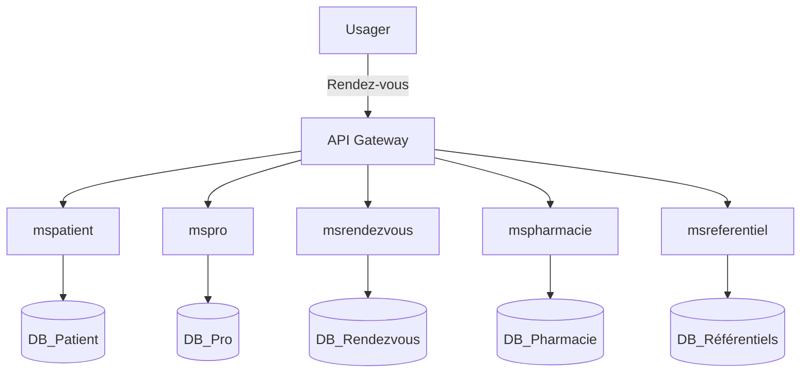

# 🩺 HOSTO – Document Technique Global v1.0 – Novembre 2025

**Auteur :** Holden Opolo Mbany  
**Organisation :** Yubile Technologie  
**Rôle :** Chef de projet / Architecte solution  

---

## 1. Présentation générale

HOSTO est une solution panafricaine de e-santé développée par **Yubile Technologie**, visant à devenir le standard africain en matière de gestion numérique des services de santé.  
Elle intègre les besoins des **usagers**, **professionnels**, **établissements hospitaliers** et **gouvernements** dans un écosystème unifié.  

La plateforme ambitionne une couverture progressive :  
**Gabon → CEMAC → Afrique francophone**, avec interconnexion régionale des systèmes hospitaliers.

---

## 2. Architecture générale de la solution

La solution repose sur une architecture **modulaire** et **microservices** :
- `msadmin` – Administration générale  
- `mspatient` – Gestion des patients  
- `mspro` – Gestion des professionnels de santé  
- `mspharmacie` – Pharmacies internes et externes  
- `msrendezvous` – Rendez-vous et téléconsultations  
- `msreferentiel` – Référentiels médicaux et géographiques
- 'mslab' - Gestion des activités des laboratoires
- '  

Chaque microservice gère un domaine fonctionnel spécifique tout en communiquant via une **API REST commune**.

### Synchronisation des données
Un système de synchronisation permet l’échange de données entre :
- les instances locales installées dans chaque structure hospitalière, et  
- le **cloud central** hébergé au Gabon.

### Environnements cibles
- **Web** : Laravel 8.3 (PHP 8.3, MySQL, Bootstrap, JQuery)  
- **Mobile & Desktop** : Flutter (Android, iOS, Windows, macOS)

---

## 3. Déclinaisons techniques

HOSTO est interopérable sur trois environnements :

- **Application web cloud** (hébergée sur Yubile/ANINF)  
- **Application mobile** (Flutter – usagers & professionnels)  
- **Application desktop** (mode offline + synchronisation sécurisée)  

Toutes les versions communiquent avec une **API REST commune Laravel**.  
Une **API publique** est prévue pour les partenaires : CNAMGS, pharmacies, laboratoires, etc.

---

## 4. Modules fonctionnels

HOSTO intègre les fonctionnalités clés du parcours de santé numérique :

- Dossier Patient Électronique (DPE)  
- Rendez-vous & téléconsultations (WebRTC / Zoom / Jitsi)  
- Ordonnances électroniques et diagnostic assisté  
- Pharmacie interne et externe (stocks, commandes, ventes, livraisons)  
- Facturation et paiements (Mobile Money, carte, cash, eBanking)  
- Assurance santé (CNAMGS, ASCOMA, OGAR, etc.)  
- Tableaux de bord & statistiques (établissement, régional, national)  
- Communication interne sécurisée (chat, notifications, emails, SMS)  
- Module IA médicale (OCR, chatbot, statistiques épidémiques)

---

## 5. Intelligence Artificielle et analyse médicale

Les briques IA locales (on-premise) incluent :

- **OCR** pour lecture automatisée des ordonnances/examens  
- **Chatbot médical** (assistance patients)  
- **Analyse statistique** des pathologies (surveillance épidémiologique)  
- **Diagnostic offline** sans connexion Internet  

Les données sont **anonymisées** et traitées en conformité avec le **RGPD** et la **loi gabonaise**.

---

## 6. Sécurité et conformité

- Respect du **RGPD** et de la **loi gabonaise sur les données personnelles**  
- Chiffrement **AES-256** (données sensibles) et **TLS 1.3** (échanges)  
- **Authentification 2FA** pour professionnels et accès DPE  
- Journalisation et audit des accès  
- Sauvegarde automatique + PCA (plan de continuité d’activité)

---

## 7. Interopérabilité et normalisation

HOSTO adopte les normes **HL7 / FHIR / ISO 13606** pour les échanges de données médicales.  

### Connecteurs prévus :
- CNAMGS (Assurance santé nationale)  
- Pharmacies et laboratoires  
- Hôpitaux publics et privés  
- Ministères de la santé  
- Plateformes régionales CEMAC

---

## 8. Accessibilité et réalités africaines

- **Version HTML Lite** pour faibles débits  
- **Mode offline** (dossiers patients, ordonnances, agenda, etc.)  
- **USSD / SMS** pour rendez-vous sans Internet  
- **Multilingue** (français, anglais, portugais, langues locales)  
- **Commande vocale intégrée**

---

## 9. Gouvernance et gestion des accès

### Rôles et profils
- Super admin
- Moderateur de contenu web  
- Hôpital / Clinique  
- Médecin/Practicien avec les differentes categorie  
- Infirmier 
- Laboratin/biologiste  
- Patient  
- Pharmacien  
- Assureur  
- Agent administratif  
- Gouvernement  

Chaque compte professionnel est validé via un **workflow d’habilitation**.  
Les autorités (Yubile / Ministère) ont un accès global **anonymisé sur les données médicales** et total sur les configurations.

---

## 10. Hébergement et infrastructure

- **Cloud central mutualisé** hébergé au Gabon (Yubile / ANINF)  
- **Instances locales** par établissement (bases de donnée synchronisées pour selon les informations que les responsables de la structure veulent pouvoir gérer à distance). Les comptes patients (sans les données médicales) et les rendez-vous sont obligatoirement synschronisées  
- **Synchronisation bidirectionnelle** locale ↔ cloud  
- Monitoring : Grafana / Laravel Telescope  
- Backups automatiques & restauration  
- **Scalabilité horizontale** via load balancer + microservices  

---

## 11. Design et expérience utilisateur

- Interface **ergonomique “3 clics”**  
- Mode clair / sombre  
- Personnalisation du logo par hôpital  
- Onboarding interactif et tutoriels  
- Conformité **WCAG** (accessibilité handicap)  

---

## 12. Architecture logique simplifiée

---

## 13. Technologies clés

| Domaine | Technologie | Version | Description |
|----------|--------------|----------|--------------|
| Backend | Laravel | 8.3 | Framework principal API REST |
| Frontend | Bootstrap + JQuery | 5.x | Interface responsive web |
| Mobile/Desktop | Flutter | 3.x | Application multiplateforme |
| Base de données | MySQL / MariaDB | 10.11+ | Données structurées médicales |
| IA | Python + TensorFlow (optionnel) | 2.x | OCR, NLP, diagnostics |
| Sécurité | SSL/TLS, AES-256, JWT | – | Sécurisation des échanges |
| Hébergement | Cloud Yubile / ANINF | – | Serveurs mutualisés & sauvegarde |

---

## 14. Gouvernance technique

- **Yubile Technologie** : conception, hébergement et maintenance  
- **Ministère de la Santé** : supervision et accès data anonymisée  
- **Partenaires** : CNAMGS, hôpitaux, pharmacies, laboratoires  
- **Objectif** : interconnexion régionale, santé numérique souveraine  

---

📦 **Fichier source :**
`HOSTO_Document_Technique_Global_v1.0.md`  
(Version GitHub / Wiki prête à publier)
